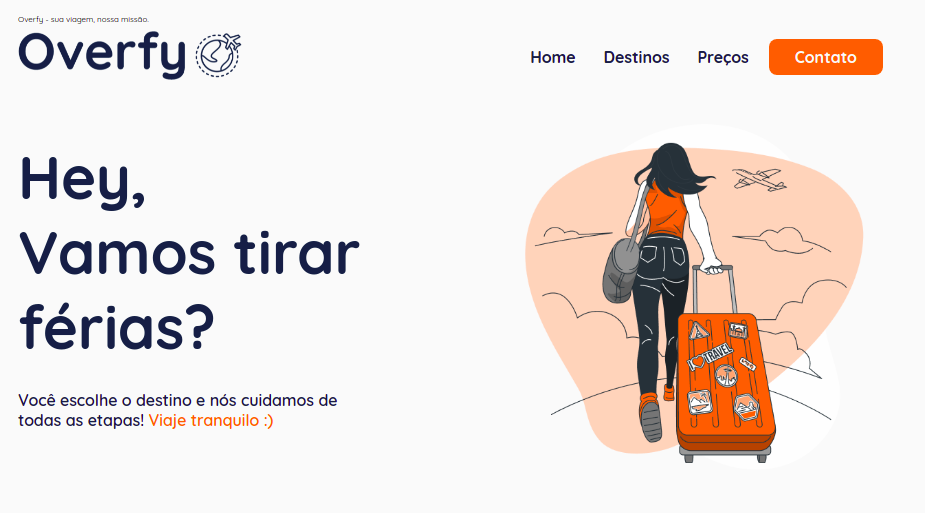
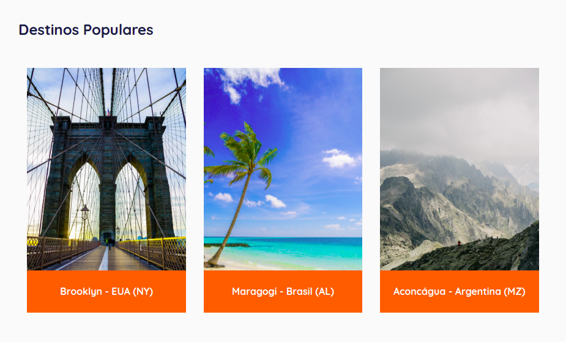
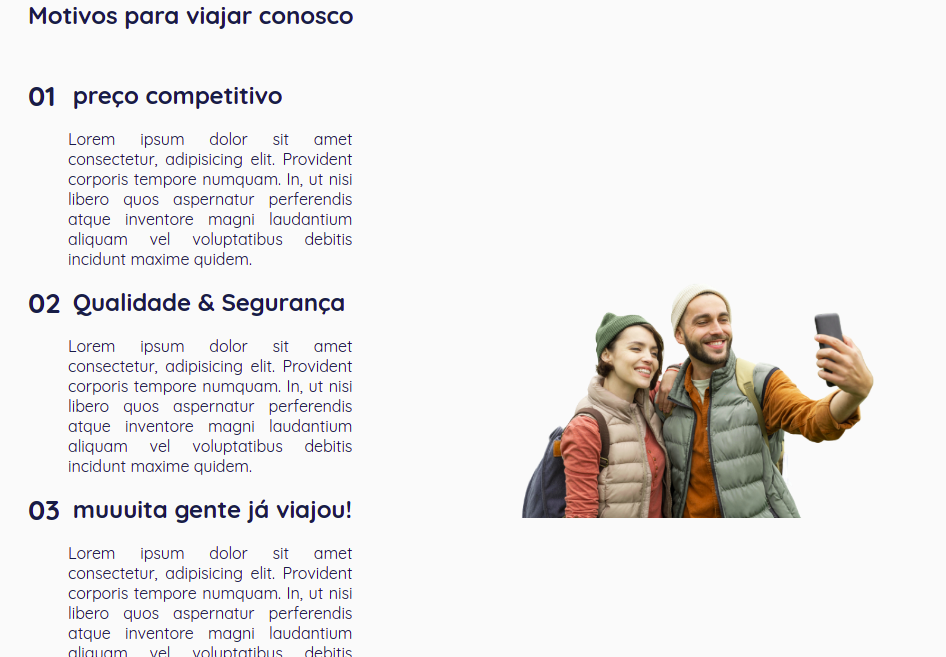
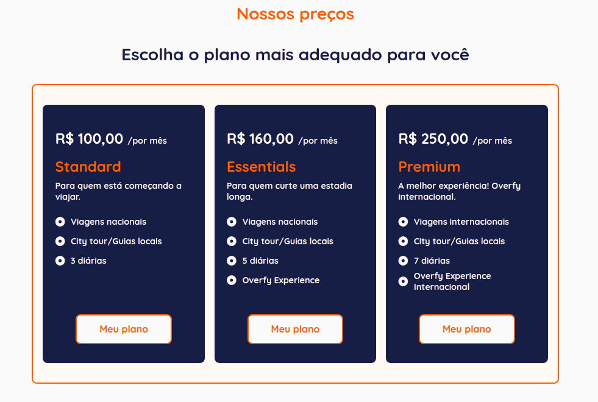
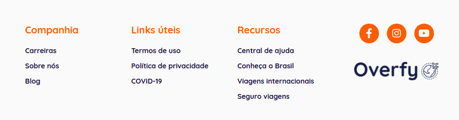
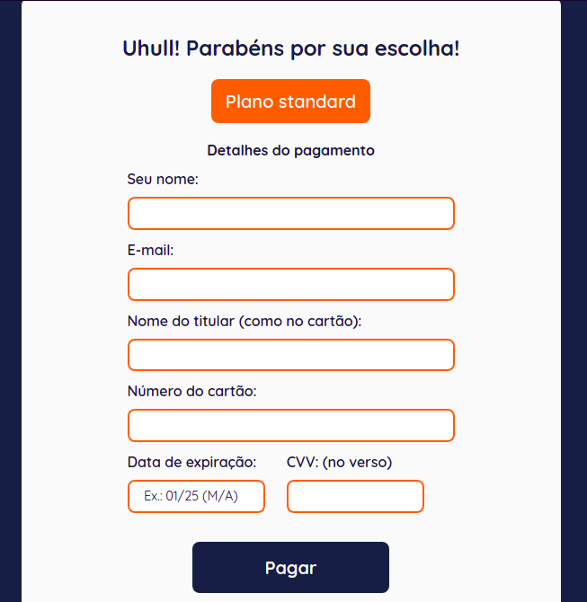
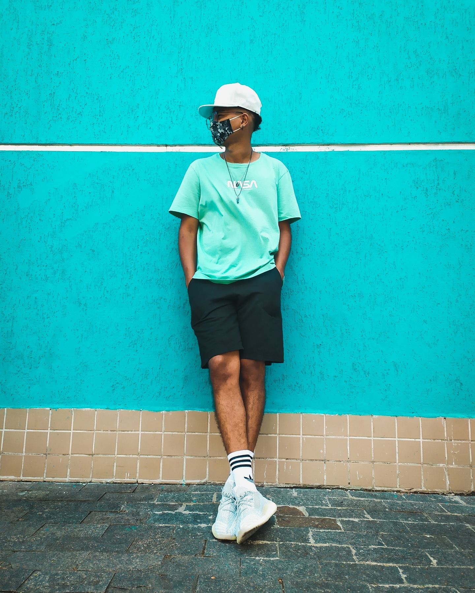

# Overfy_Viagens
Site desenvolvido a partir do evento Digital Make Week #2 [12 a 16 de julho 2021]

# Overfy

### Após selecionar o plano, abre nessa tela onde é exibido o formulário para o usuário.

### Tecnologias utilizadas

O projeto foi feito com essas 3 tecnologias.

- [x] Html
- [x] Css
- [x] JavaScript

Site responsivo para monitor, tablets e smartphones.

## 🤝 Colaborador

<table>
  <tr>
    <td align="center">
      <a href="https://www.linkedin.com/in/stanley-rodrigues/">
         
        
          <b>Stanley Rodrigues</b>
        
      </a>
    </td>
  </tr>
</table>
